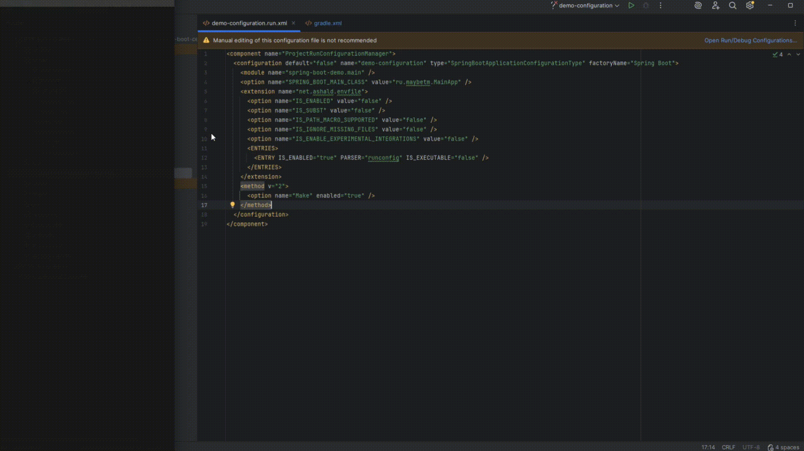

#  Spring Boot CE Launcher

A plugin for launching applications based on saved [Spring Boot configurations](spring-boot-demo/.run/demo-configuration.run.xml) in IntelliJ IDEA Community Edition.  
More about run configurations on the [JetBrains website](https://www.jetbrains.com/help/idea/run-debug-configuration.html#create-folder-run-config).

## Before

IntelliJ IDEA CE cannot recognize Spring Boot run configurations, so it is not possible to launch an application using a saved config.

docs/after.gif

## After

After installing the plugin, IntelliJ IDEA CE will be able to recognize Spring Boot configurations.  
You can run applications in the Community Edition environment, as well as read and edit the configuration.

